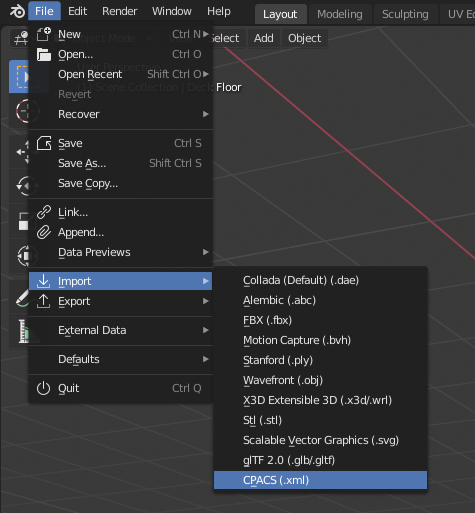
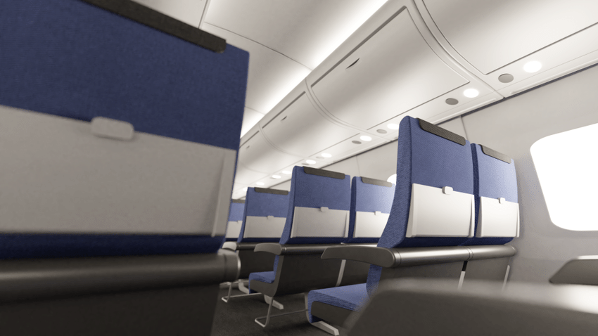
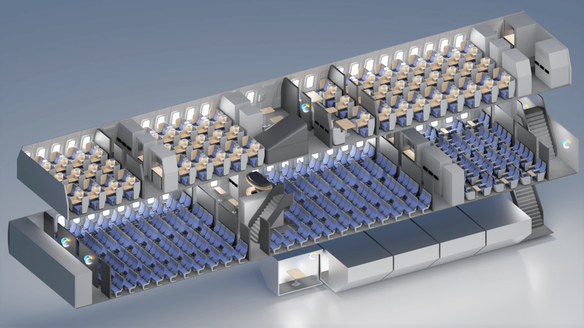

# CPACS import addon for Blender

Import CPACS xml files directly into Blender and turn them into a detailed 3D fuselage and cabin model. With already applied textures, lights and cameras you are ready to go for high quality renders of your cabin and fuselage design. 

## Features
- Import CPACS '.xml' files directly into Blender.
- All cabin and fuselage objects are placed accurately.
- Lights and camera are placed automatically.
- Textures and materials are applied automatically. 
- When the automatic import is done, you are immediately ready to go for rendering.

## Notes
- Currently, the following CPACS nodes are supported:
    - Fuselage geometry
    - Decks and all sub elements (floor elements, seats etc.)
- Note that the 3D models of Bauhaus Luftfahrt are currenly not included in the addon. Include your own 3D models or import the cabin objects as cube representations.

## Installation
*The addon is currently still under development. As soon as the addon is ready to ship, there will be information on how to install the script here.* 

## Usage
Go to ```File → Import → CPACS (.xml)```. Wait a few seconds for the import to finish.



## Examples
The following images were rendered with minimal post processing after using the CPACS import addon. Both images were published with the publication referenced below. *(Both images (c) 2020 Bauhaus Luftfahrt e.V.)*




## Publications
Fore more information, check out the following publication:
- Engelmann, M.; Drust, D.; Hornung, M. (2020): Automated 3D cabin generation with PAXelerate and Blender using the CPACS file format. Deutsche Gesellschaft für Luft- und Raumfahrt - Lilienthal-Oberth e.V.. (Text). https://doi.org/10.25967/530014. 
 
## About Blender 
[Blender](https://www.blender.org/) is the free and open source 3D creation suite. It supports the entirety of the 3D pipeline—modeling, rigging, animation, simulation, rendering, compositing and motion tracking, video editing and 2D animation pipeline.

## About
Copyright (c) 2020 -2021 [Bauhaus Luftfahrt e.V.](http://www.bauhaus-luftfahrt.net/?set_language=en). All rights reserved. This program and the accompanying materials are made available under the terms of the GNU General Public License v3.0 which accompanies this distribution, and is available at https://www.gnu.org/licenses/gpl-3.0.html.en.</copyright>

## About CPACS
Copyright (c) 2018 Deutsches Zentrum für Luft- und Raumfahrt e.V., Institute of System Architectures in Aeronautics, [www.cpacs.de](www.cpacs.de).
